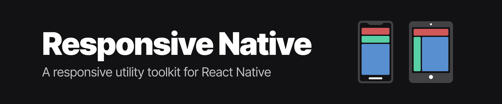

Responsive applications are a big challenge for mobile developers.

Most of the mobile devices have different dimensions and densities, so using absolute units like pixels ('px') can cause elements to have different sizes than expected.

As iPhones, for example, have a higher pixel density than Android phones, if you use `16px` in a Text, it will look much larger on Android than on iOS.

This library aims to solve this problem by converting this value from `px` to `rem`. The value in rem is calculated with some variables such as device width and height, thus providing a much more proportional interface.

It also includes an easy way to create Media Queries just like the web environment but based on breakpoints as inside mobile devices we do not need to deal a lot with screen resizing while the app is running.

## Getting started

Install the library using:

```sh
yarn add responsive-native react-native-safe-area-context
```

_The lib `react-native-safe-area-context` must be installed._

## Wrap the application with the provider

You can import the `ScreenProvider` and wrap the whole App with it then all child components will be able to consume and use the responsive functions.

#### Set the `baseFontSize`

ScreenProvider receives a optional `baseFontSize` prop that corresponds to the value of `1rem`. By default `1rem = 16px`, but depending on your UI, you would prefer setting this to a different value to provide an easier way to achieve some values in spacings or sizes.

```js
import { ScreenProvider } from 'responsive-native';
import { SafeAreaProvider } from 'react-native-safe-area-context';

export default function App() {
  return (
    <SafeAreaProvider>
      <ScreenProvider baseFontSize={16}>
        { ... }
      </ScreenProvider>
    </SafeAreaProvider>
  )
}
```

_`ScreenProvider` depends on `SafeAreaProvider`, from [react-native-safe-area-context](https://github.com/th3rdwave/react-native-safe-area-context), so put `SafeAreaProvider` around `ScreenProvider`._

## Library hooks

### useRem

Transforms a `rem` value to the best pixel value based on the device width, height and accessibility preferences.

The `useRem` hook receives as first param the value in `rem` that will be converted to pixels. The second optional parameter is `shouldScale` that is a boolean (defaults to `false`) that tells if the fontScale defined by the user device should be used in the conversion (if you're using rem to define font sizes, you might want to use this as `true`).

_You can read a little more about `fontScale` [here](https://reactnative.dev/docs/pixelratio#getfontscale)_

```jsx
export function MyComponent() {
  const rem = useRem();

  return (
    <View style={styles.container}>
      <Text style={[styles.text, { fontSize: rem(1.5, true) }]}>Hello World!</Text>
    </View>
  );
}
```

### useMediaQuery

Returns `true` if the conditions match the device.

The `useMediaQuery` hook receive as params:

```ts
{
  platform: 'ios' | 'android' | 'web' | 'windows' | 'macos';
  minBreakpoint: 'sm' | 'md' | 'lg' | 'xlg';
  maxBreakpoint: 'sm' | 'md' | 'lg' | 'xlg';
}
```

```jsx
export function MyComponent() {
  const showSideNav = useMediaQuery({
    minBreakpoint: 'lg',
  });

  return (
    <View style={styles.container}>
      { showSideNav ? <SideNav /> : <DefaultNav /> }
    </View>
  );
}
```

### useBreakpointValue

Returns the desired value based on the breakpoint.

You can pass different values so your interface will adapt devices different sizes. The `useBreakpointValue` hook can return any value, including JSX elements. The `base` value is always required and will be used if the device breakpoint was not matched by the other rules.

```jsx
export function MyComponent() {
  const textByBreakpoint = useBreakpointValue({
    sm: "I'm a small device",
    md: "I'm a medium device",
    base: "I will be used in any larger device than md",
  });

  return (
    <View style={styles.container}>
      <Text style={styles.text}>{textByBreakpoint}</Text>
    </View>
  );
}
```

### useResponsiveStyles

```tsx
const responsiveStyles = createResponsiveStyleSheet((rem) => {
  return {
    button: {
      width: rem(4),
      padding: rem(2),
      bottom: rem(2),
    },

    title: {
      fontSize: rem(2),
    },
  };
});

function Button() {
  const styles = useResponsiveStyle(responsiveStyles);

  return (
    <TouchableOpacity onPress={() => {}} style={styles.button}>
      <Text style={styles.title}>Entrar</Text>
    </TouchableOpacity>
  )
}
```

### useScreen

Returns an object with important information about the device screen.

```ts
{
  padding: {
    top: number;
    bottom: number;
    left: number;
    right: number;
  };
  breakpoint: {
    size: 'sm' | 'md' | 'lg' | 'xlg';
    maxWidth: number;
  };
  pixelRatio: number;
  fontScaleFactor: number;
  baseFontSize: number;
}
```

You might want use `useScreen` to get information like `padding` so you can use it on Header or TabBar components so it doesn't stay under non-clickable areas.

## Integration

### styled-components

If you're using `styled-components`, you can integrate this library functionality into your `ThemeProvider`.

Create a new `ThemeProvider` based on this [example](https://gist.github.com/fhugoduarte/60d3c898ee40944e99af57f53121ec90#file-themeprovider-tsx) and use it instead of the standard styled-components `ThemeProvider`.

#### Typescript

If you're using **TypeScript**, you'll have to add the responsive-native functions along with your theme typings, just follow the [example](https://gist.github.com/fhugoduarte/60d3c898ee40944e99af57f53121ec90#file-styled-d-ts).

#### Usage

```jsx
import styled from 'styled-components/native';

export const Container = styled.Text`
  font-size: ${({ theme }) => theme.screen.rem(12)}px;
`;
```

_We know, this is the shortest syntax, so we created an example [VSCode snippet](https://gist.github.com/fhugoduarte/60d3c898ee40944e99af57f53121ec90#file-rem-code-snippets) so you can add it inside VSCode and just type 'rem' and it will autocomplete for you._

## Contributing

Thank you for being interested in making this package better. We encourage everyone to help improve this project with new features, bug fixes, or performance improvements. Please take a little bit of your time to read our guide to make this process faster and easier.

### Contribution Guidelines

To understand how to submit an issue, commit and create pull requests, check our [Contribution Guidelines](/CONTRIBUTING.md).

## License

MIT License © [Diego Fernandes](https://github.com/diego3g)
